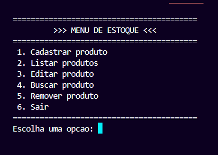
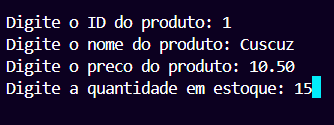
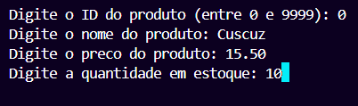
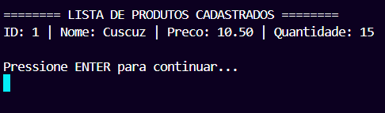
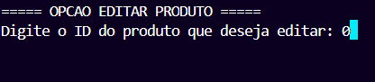
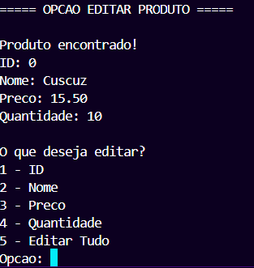
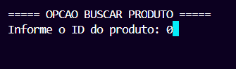
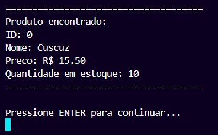
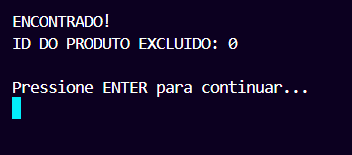
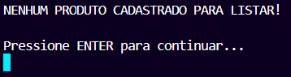

# 📋 Sistema de Gerenciamento de Estoque
[]()
[]()

## 📌 Informações do Projeto

**🏫 Universidade:** Universidade Federal do Piauí - Campus Senador Helvídio Nunes de Barros  
**🎓 Curso:** Bacharelado em Sistemas de Informação  
**📚 Disciplina:** Algoritmos e Programação I  
**👩‍🏫 Professor(a):** Dra. Alcilene Dalília de Sousa  

**👥 Equipe:**
- Mayan
- Lyan
- Betânia
- Allana
- Débora

## 🚀 Descrição do Projeto

Sistema de gerenciamento de estoque desenvolvido em C que permite:  
🛒 Cadastrar | 🔍 Buscar | ✏️ Editar | 📜 Listar produtos | 🗑️ Remover 

## 📂 Estrutura do Projeto

```
projeto_estoque/
├── 📄 main.c                 # Arquivo principal
├── 📂 screenshots            # Capturas de tela
├── 📂 modules/
│   ├── 📄 funcoes_estoque.c  # Funções do estoque
│   ├── 📄 funcoes_estoque.h  # Cabeçalhos
│   ├── 📄 modulo_print.c     # Funções de exibição
│   └── 📄 modulo_print.h     # Cabeçalhos
└── 📄 README.md              # Documentação do projeto
```

## 💻 Como Compilar e Executar

### 🔧 Compilação e Execução
```bash
#Windows
gcc main.c modules/funcoes_estoque.c modules/modulo_print.c -o estoque.exe
.\estoque.exe
```
## ✨ Funcionalidades

1. **📝 Cadastrar Produto**
   - ✅ Verifica IDs duplicados
   - ⚠️ Limite de 100 produtos

2. **📋 Listar Produtos**
   - 🔄 Ordenado por ID
   - 📊 Exibe todos os atributos

3. 🔍 Buscar Produto
   - 🔎 Por ID
   - 📌 Exibe detalhes completos

4. ✏️ Editar Produto
   - 🔄 Atualiza individualmente:
     - #️⃣ ID
     - 🔤 Nome
     - 💲 Preço
     - 🧮 Quantidade

5. 🗑️ Remover Produto
   - ⚠️ Confirmação antes de excluir
   - 🔄 Reorganiza a lista automaticamente


## 🖼️ Demonstração Visual

<div align="center">
  <h3>🎛️ Menu Principal</h3>
  
  <p><em>Interface principal com todas as operações disponíveis</em></p>
  
  <h3>📝 Cadastro de Produto</h3>
  
  
  <p><em>Formulário para registro de novos itens no estoque</em></p>

  <h3>📋 Listagem de Produtos</h3>
  
  <p><em>Visualização completa do inventário com ordenação</em></p>

  <h3>📋 Edição de Produtos</h3>
  
  
  
  <p><em>Interface principal do menu editar</em></p>

  <h3>📋 Busca de Produto</h3>
  
  
  
  <p><em>Relatório de busca por produto</em></p>

  <h3>📋 Exclusão de Produto</h3>
  
  
  
  
  <p><em>Interface principal da opção excluir</em></p>

</div>

## 🛠️ Tecnologias Utilizadas

- **🔢 Vetores** para armazenamento
- **📊 Estruturas** para organização dos dados
- **🔄 Algoritmos** de ordenação e busca

## 🐛 Bugs Conhecidos

| Ícone | Problema            | Gravidade | Descrição                                                                 |
|-------|---------------------|-----------|---------------------------------------------------------------------------|
| 🔢    | Números em nomes    | ⚠️ Alto   | Campo "nome" aceita valores numéricos indevidamente                      |
| 📛    | Nomes longos        | ⚠️ Médio  | Nomes > 49 caracteres causam problemas de exibição                       |
| 🖥️    | Portabilidade       | ⚠️ Alto   | Funciona melhor no Windows que em outros sistemas operacionais           |